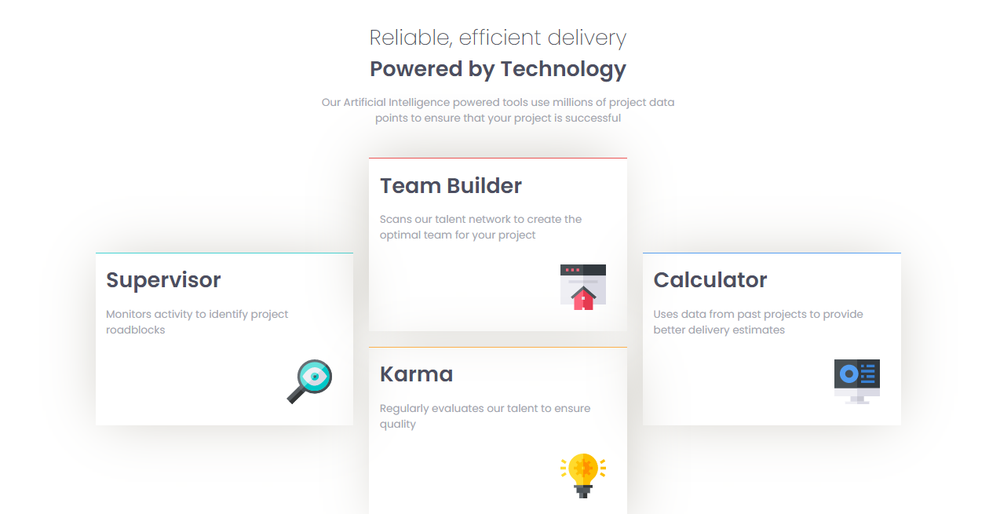
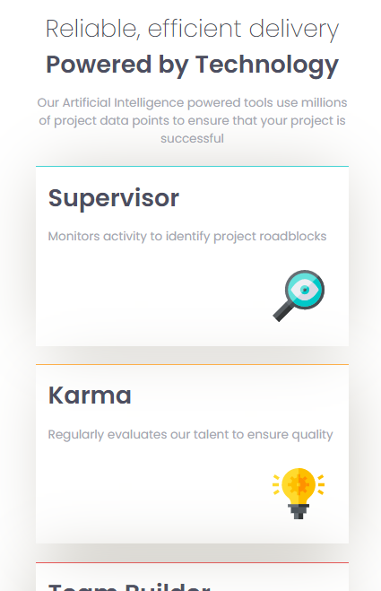

# Frontend Mentor - Four card feature section solution

This is a solution to the [Four card feature section challenge on Frontend Mentor](https://www.frontendmentor.io/challenges/four-card-feature-section-weK1eFYK). Frontend Mentor challenges help you improve your coding skills by building realistic projects.

## Table of contents

- [Overview](#overview)
  - [The challenge](#the-challenge)
  - [Screenshot](#screenshot)
  - [Links](#links)
  - [Built with](#built-with)
  - [Useful resources](#useful-resources)
- [Author](#author)
- [Acknowledgments](#acknowledgments)

## Overview

### The challenge

Users should be able to:

- View the optimal layout for the site depending on their device's screen size

### Screenshot

### Links

- Solution URL: [https://www.frontendmentor.io/challenges/four-card-feature-section-weK1eFYK/hub/fourcardfeaturesection-grid-flexbox-bem-9J7HaZ2ne](https://www.frontendmentor.io/challenges/four-card-feature-section-weK1eFYK/hub/fourcardfeaturesection-grid-flexbox-bem-9J7HaZ2ne)
- Live Site URL: [https://brkcln.github.io/Four-card-feature-section/](https://brkcln.github.io/Four-card-feature-section/)

### Built with

- Semantic HTML5 markup,
- Flexbox,
- BEM,
- Grid,

### Useful resources

- [stackoverflow](https://stackoverflow.com/)
- [MDN web doc](https://developer.mozilla.org/)
- [Csstricks](https://css-tricks.com)

## Author

- Website - [@brkcln](https://brkcln.github.io/brkcln)
- Frontend Mentor - [@brkcln](https://www.frontendmentor.io/profile/brkcln)
- Github - [@brkcln](https://github.com/brkcln)
